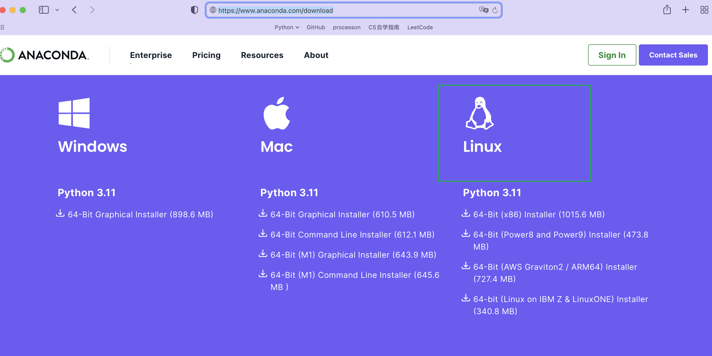
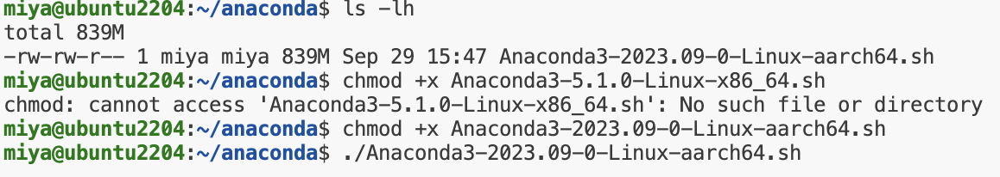
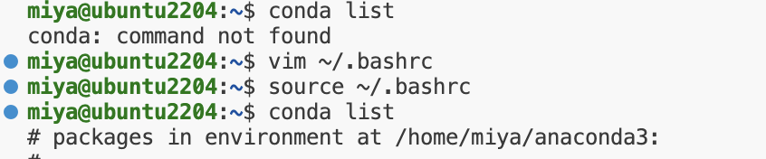

1. 进入anaconda官网，找到所需要的Linux版本的下载链接，我的是arm64位的：Anaconda3-2023.09-0-Linux-aarch64.sh

   

2. wget https://repo.anaconda.com/archive/Anaconda3-2023.09-0-Linux-aarch64.sh

3. ls -lh 看一下Anaconda3-2023.09-0-Linux-aarch64.sh的执行权限，如下所示，没有x执行权限，给它加上 chmod +x，执行

   

4. 注意，上一步需要enter好多下，enter的时候注意看一下，到最后的时候有个地方需要我们填 yes ，不要一直enter个没完233333

5. `conda list`，发现错误  `conda:command not found`，原因：环境变量没有配好

6. 配置环境变量 `vim ~/.bashrc`

   在最后一行加入：`export PATH=$PATH:/home/miya（换成自己的用户名）/anaconda3/bin`    【vim: 按 i 进入编辑模式；编辑完成按esc键，输入:wq  保存退出】

   `source ~/.bashrc` 使配置生效

   