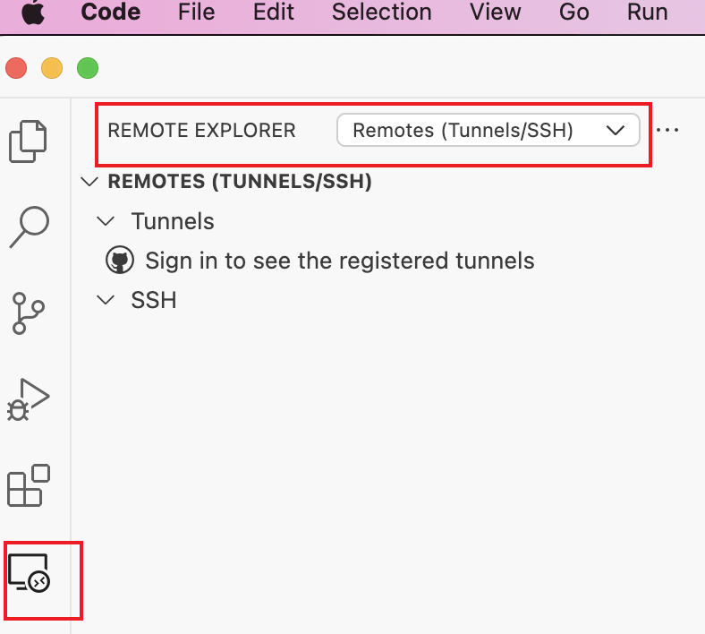
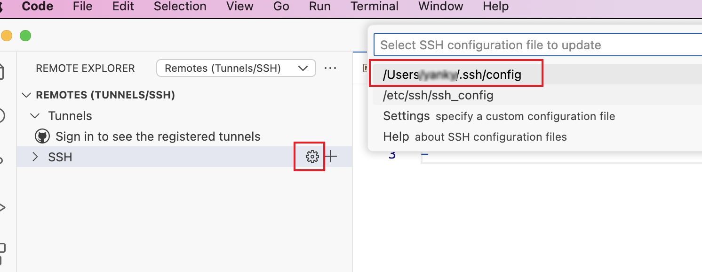
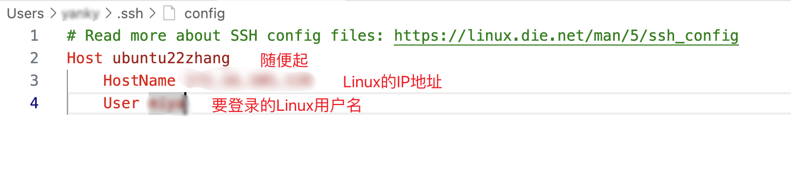
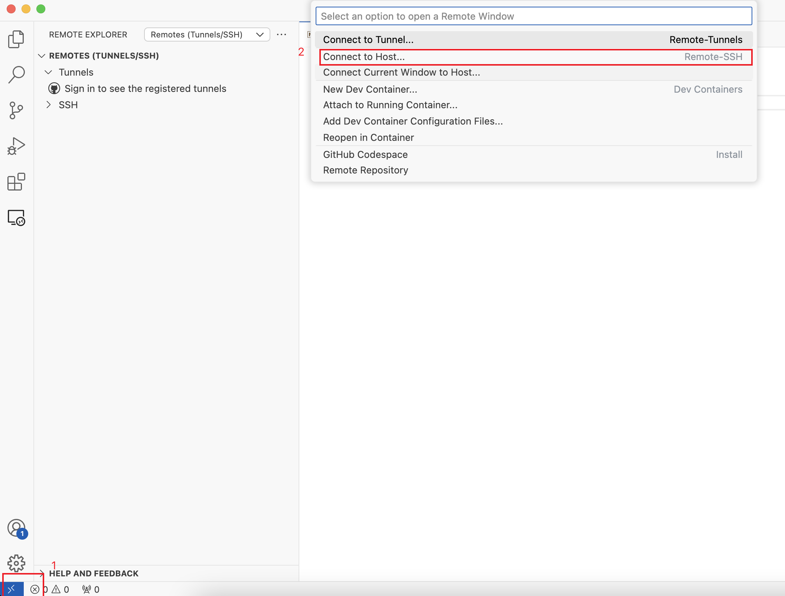
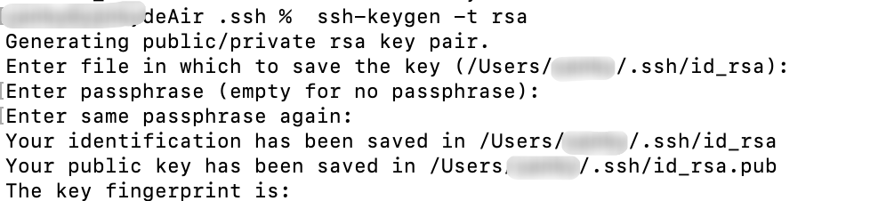
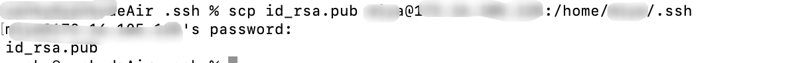
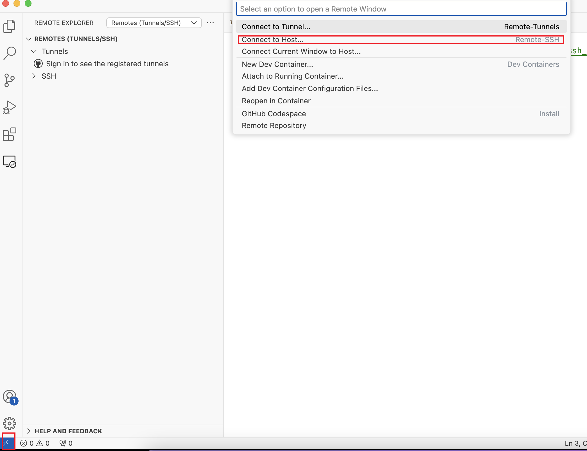

这篇文档适用于**第一次在本机（mac）上连接到Linux**的情况，**重装Linux系统**之后我们需要对**本地known_hosts**文件做出改变，详见[重装Linux远程登录失效](./重装Linux远程登录失效.md)【**known_hosts**文件用于验证远程登陆系统的身份。ssh可以自动将密钥添加到用户文件，也可以手动添加。该文件包含用户已连接过所有主机的公共密钥列表。一般，初次登陆，ssh会自动将远程主机的公钥添加到用户的known_hosts文件。】

# vscode远程登录Linux（输密码）

1. vscode 安装插件:Code Remote Development，安装完成后注意vscode左侧

2. 点击vscode最左侧的远程管理器，按下图操作，选择 Remotes ssh

3. 打开ssh配置

4. 编辑配置ssh

5. 登录，后面按vscode提示输登录密码操作即可

上面的操作，我们每次都需要输入密码，比较麻烦，那么我们怎么实现免密登录呢？

# 免密登录配置

1. 打开自己的win或者mac终端，输入 `ssh-keygen -t rsa`生成公私钥

​		

2. scp命令：把公钥发送给Linux，如上图，公钥存在 id_rsq.pub 中，按照自己电脑上的提示得到公钥路径

   ~~~bash
   scp id_rsa.pub linux用户名@LinuxIP:/home/Linux用户名/.ssh
   ~~~

   

3. 进入Linux终端，cd到`/home/Linux用户名/.ssh`目录下

   如果目录下没有 authorized_keys 文件，`touch authorized_keys `创建authorized_keys 文件

   将公钥存到authorized_keys 中：`cat id_rsa.pub >> authorized_keys `

​		删除 Linux中的 id_rsa.pub 文件：`rm id_rsa.pub `

4.  查看是否生效，点vscode左下角，如下（和上一节步骤5一样）但是但是不会出现需要输密码的情况，说明我们成功了！！！

​		

