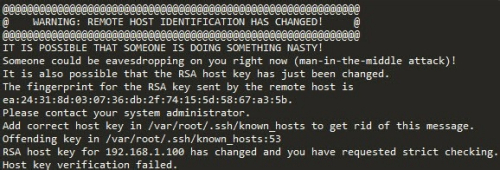

# ssh连接所生成的known_hosts出现的问题

**【解决办法】清除旧的公钥信息:`ssh-keygen -R 远程主机IP`**

【注意】我们使用的scp命令使用了ssh的功能，也会出现类似的情况。

问题原因：

OpenSSH会把我们ssh远程访问过的计算机的公钥(public key)都记录在   /Users/user_name/.ssh/known_hosts。

当下次访问相同计算机时，OpenSSH会核对公钥。如果公钥不同，OpenSSH会发出警告。

如果我们重新安装系统，其公钥信息还在，ssh会报错出现类似下面的情况

方法一：
`rm -rf ~/.ssh/known_hosts`

缺点：把其他正确的公钥信息也删除，下次链接要全部重新经过认证

方法二：

`vi ~/.ssh/known_hosts`

删除对应ip的相关rsa信息

优点：其他正确的公钥信息保留

缺点：还要vi，还要找到对应信息，稍微优点繁琐

方法三：

清除旧的公钥信息

`ssh-keygen -R 远程主机IP`

清除旧的公钥后，请参考[vscode远程登录Linux](./vscode远程登录Linux.md) 的 免密登录配置 的2、3、4