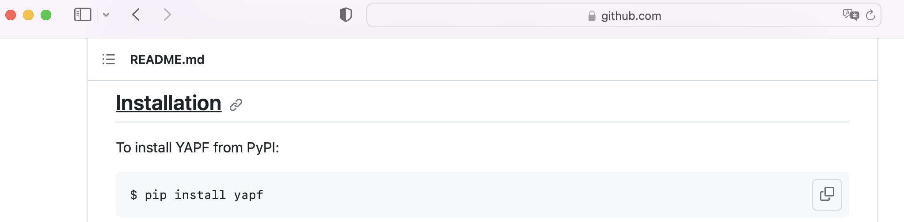
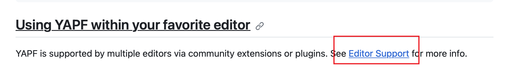
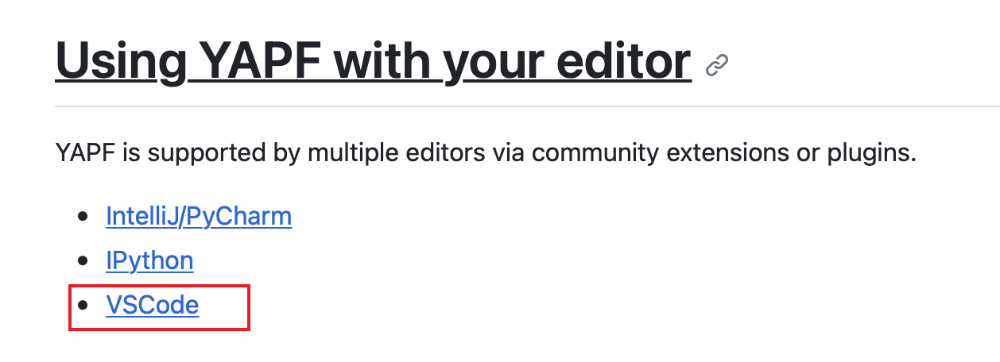
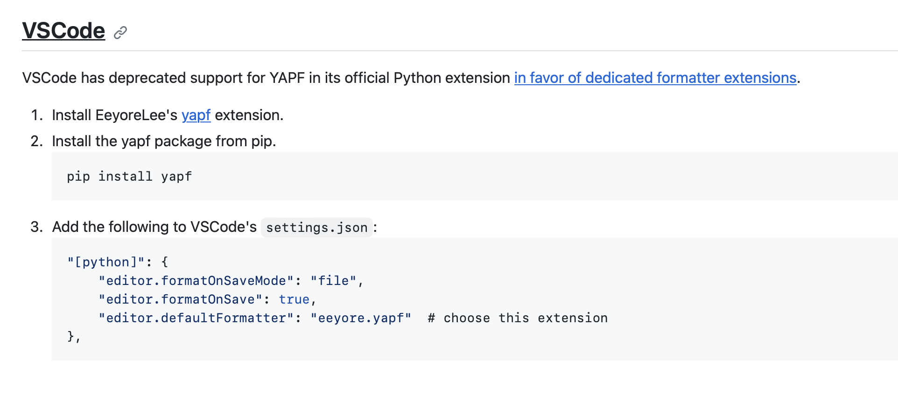
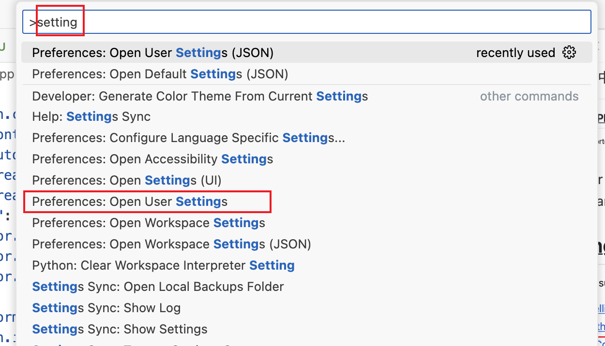

# 插件

- Code Runner：运行代码

- Error Lens：错误提示神器

- Markdown Preview Enhanced：markdown预览插件，写md文件，在vscode实现所见即所得

- vscode-icons：vscode文件夹换标

## python代码格式化yapf

1. pip3 install yapf

2. yapf插件安装和配置，参考GitHub官方仓库：readme文档

   readme文档【每个开源项目都必须先看这个文档，质量高的开源readme一般写得不错】

   https://github.com/google/yapf

   - 安装： $ pip install yapf

      

   - 在vscode中使用yapf

      

      进入editor support后, 找到我们使用的编辑器vscode（其实可以看到在pycharm中也是可以用的）

      
      
   
      先按照1 安装vscode插件
      按照3 修改配置，打开settings.json，复制

      ？不知道如何打开settings.json 
      
      1. mac: command+shift+p 
         win: ctrl+shift+p

      2. 输入setting，选择preference：open user settings

         

      3. 修改配置文件settings.json
      
