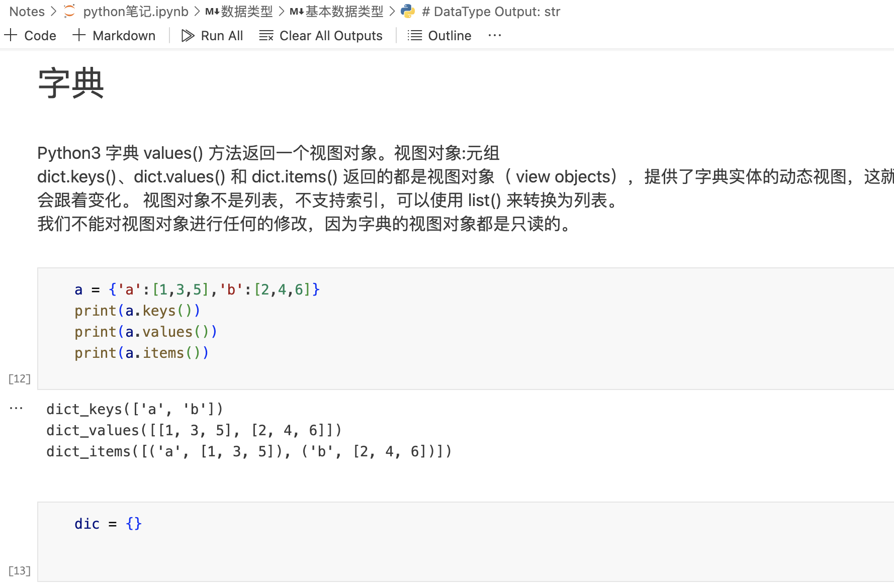

# 插件

去Anaconda官网下载安装，安装完成之后，打开

之前我一般会点击 launch jupyter notebook，它特别适合学习Python，可以一个单元格一个单元格的执行，执行有误还可以返回修改重新执行，执行结果会直接显示在单元格下方，特别方便。

后面我选择在vscode中使用jupyter，因为有时候还需要做别的，这样不需要离开vscode，直接安装vscode的**jupyter插件**就可以，我感觉我需要的网页版jupyter的功能在 vscode中都有。

# Jupyter

## 允许多行输出

~~~
# 临时允许多行输出
from IPython.core.interactiveshell import InteractiveShell
InteractiveShell.ast_node_interactivity = "all"  # 默认 last_expr
~~~

