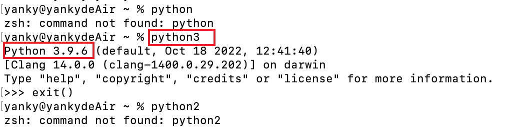
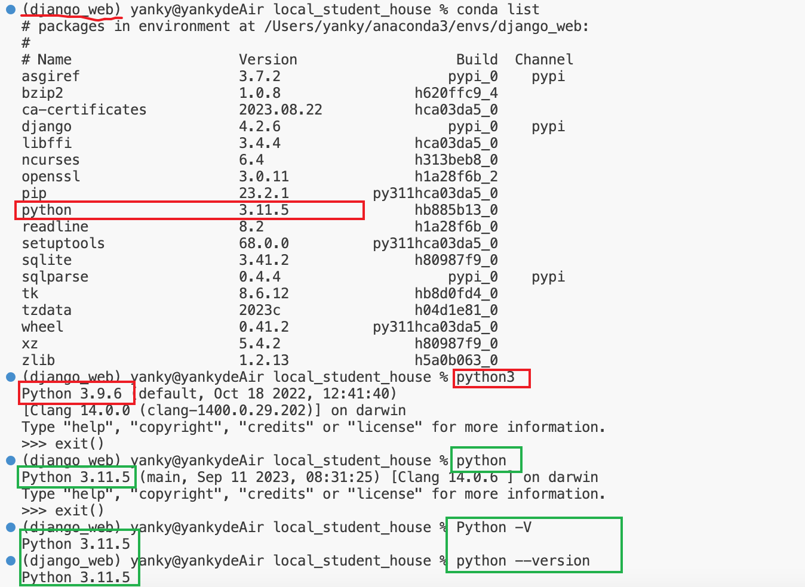

**mac 本机 非虚拟环境下，使用`python3`**

**conda创建的虚拟环境下，使用 `python`，这样虚拟环境的python版本才是我们想要的**

1. 首先，我的Mac系统自带的Python版本是3.9.6

   

2. 我的项目使用的是虚拟环境django_web，我的django_web是用conda 创建的，创建时指定的版本号是3.11

   ~~~bash
   conda create --name django_web python=3.11   
   ~~~

3. 最开始我在虚拟环境下，按照在mac本机环境运行Python的方式，也就是使用`python3`命令，但是但是，请注意，用这个命令的话，运行我们的项目用的就是本机的python3.9版本，而不是3.11版本，**在虚拟环境下，我们要使用 `python`命令！！！！**

   